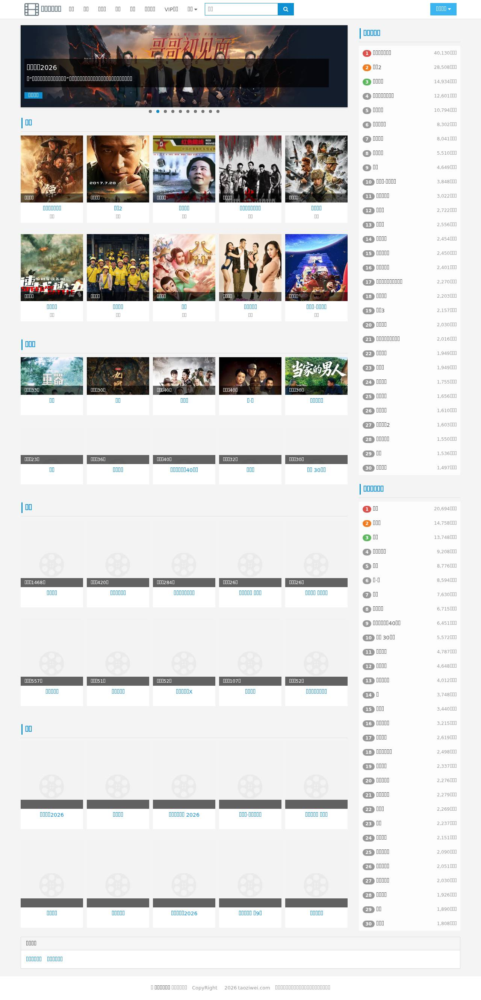
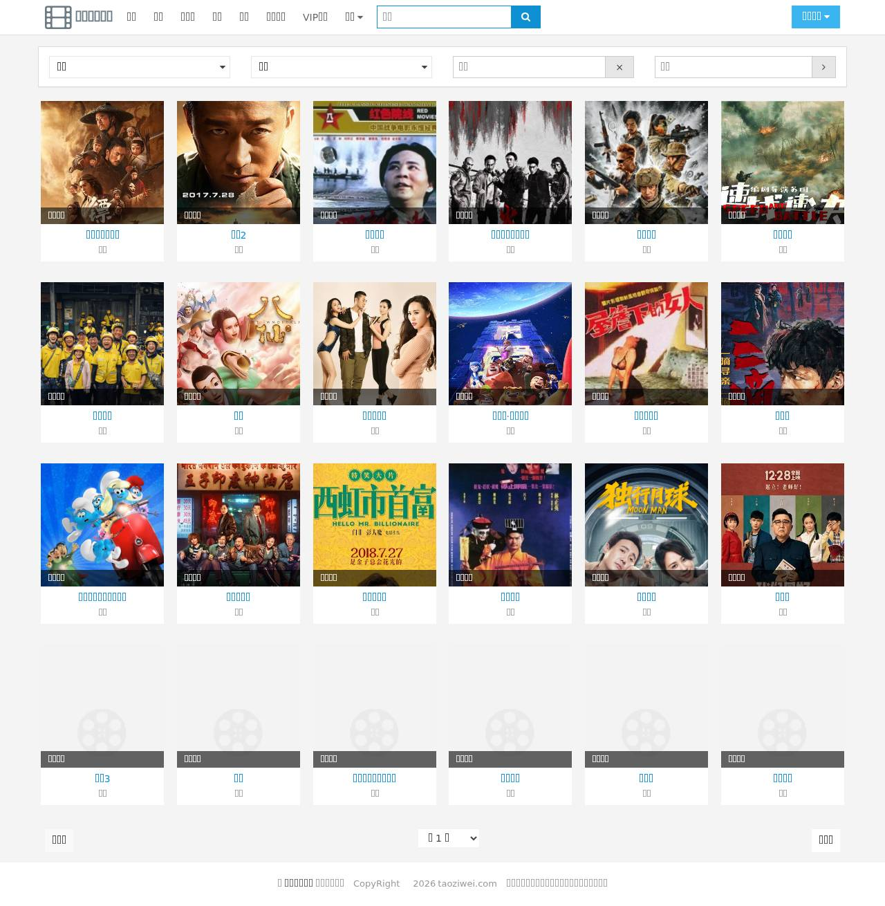
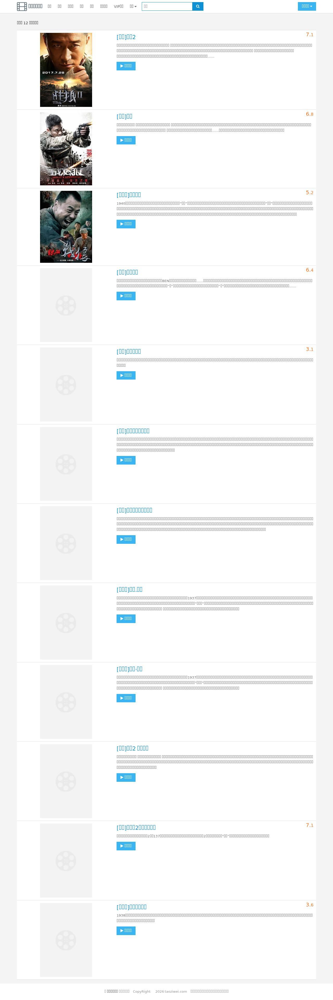
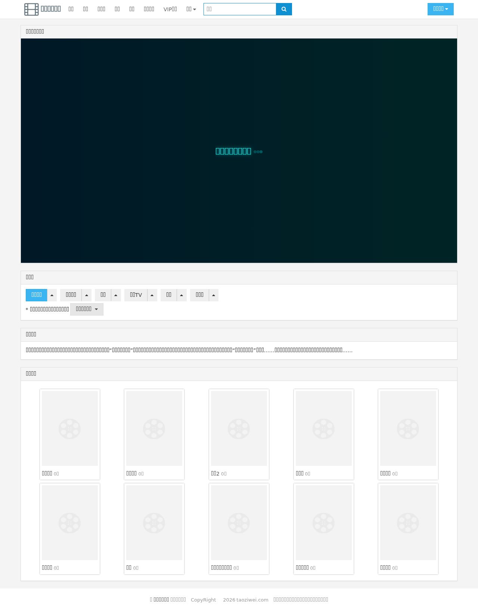
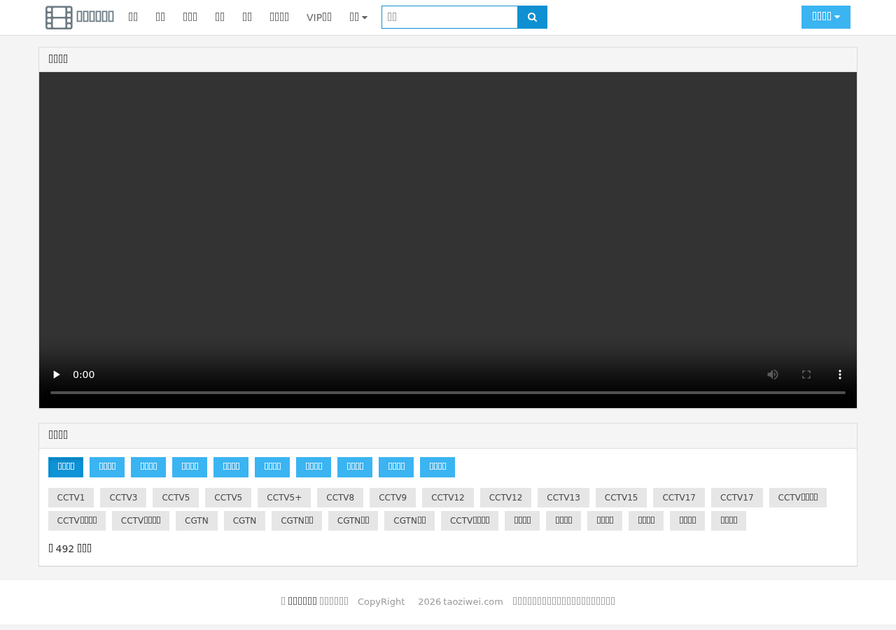
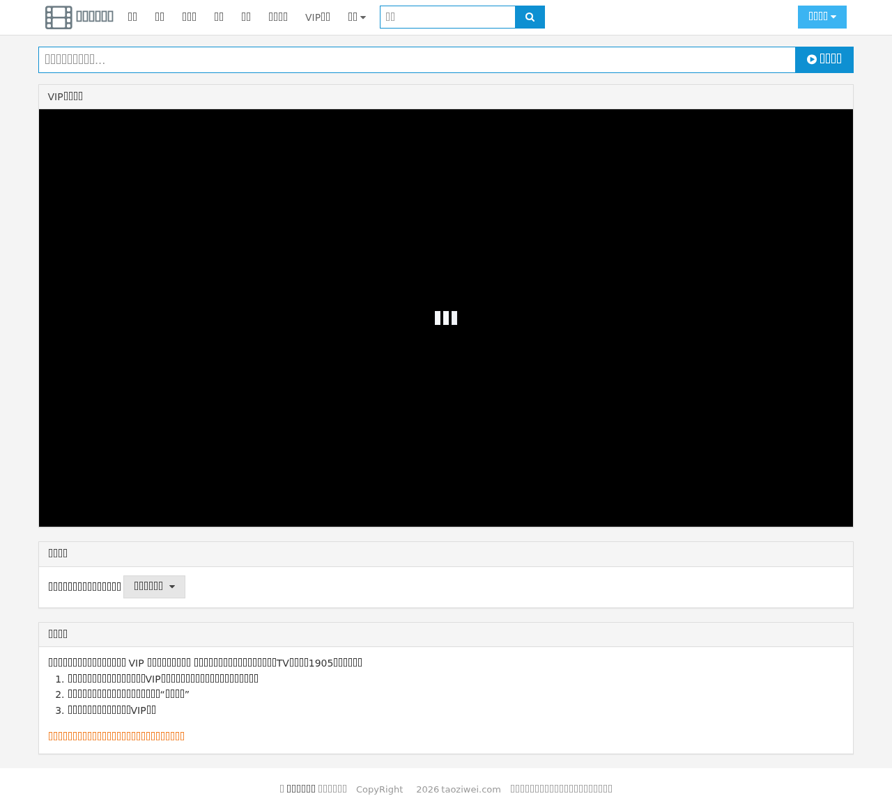

# 🍑 桃子味影院（mkmovie）

一个基于 **PHP + AmazeUI** 的免费在线影视站，数据源全部来自 360kan（360影视）公开 JSON 接口。无需数据库、无需后台，纯 PHP 页面 + 接口采集即可运行。

> 🌐 **在线演示**：https://movie.taoziwei.com/

## 📸 截图预览

**首页**（banner 轮播 + 分类列表 + 热播榜）


**电影列表**（分类 / 地区 / 年份 / 主演筛选）


**搜索页**


**播放页**（多源站切换 + 解析接口）


**电视直播**（分组频道 + HLS 播放）


**VIP 解析**


## ✨ 功能特性

- 🎬 **四大分类**：电影、电视剧、动漫、综艺（支持分类 / 地区 / 年份 / 主演筛选与分页）
- 🔍 **全站搜索**：关键词模糊搜索
- ▶️ **在线播放**：聚合多视频源站（爱奇艺 / 优酷 / 腾讯 / 芒果TV / B站等），播放页可切换播放源与解析接口
- 📺 **电视直播**：TXT 直播源分组展示，内置已验证频道列表，经同源代理解决 m3u8 跨域 / 防盗链问题
- 💎 **VIP 解析**：内置多个第三方解析接口，粘贴任意视频链接即可破解播放
- 📜 **播放记录**：基于浏览器本地存储（localStorage）的观看历史
- 📱 **响应式布局**：桌面端 / 移动端自适应，移动端底部导航栏

## 🛠 技术栈

| 类别 | 技术 |
|------|------|
| 后端 | PHP（无框架、无数据库、无后台） |
| 前端 | AmazeUI 2.x、jQuery、hls.js |
| 数据源 | 360kan 公开 JSON API（`api.web.360kan.com` / `api.so.360kan.com`） |

## 🚀 快速开始

### 环境要求

- PHP >= 5.6（推荐 7.x / 8.x），需开启 `curl` 扩展
- 任意 Web 服务器（Nginx / Apache）或 PHP 内置服务器

### 部署步骤

1. **下载代码**：将本项目文件上传到网站根目录（或 `git clone`）
2. **配置站点**：打开 `config.php`，设置站点信息：

```php
$webConfig = array(
    'siteurl' => '',                    // 网站网址（部署在站点根目录时留空；子目录部署填对应路径）
    'name' => '桃子味🍑影院',           // 网站名称
    'slogan' => '无广告在线看电影',     // 网站口号
    'videoapi' => array( ... ),         // VIP 解析接口列表（见下方说明）
);
```

3. **访问首页**：浏览器打开站点地址即可使用

### 本地预览（PHP 内置服务器）

```bash
php -S 0.0.0.0:8080 -t /workspace
```

访问 `http://localhost:8080`。

## 📁 目录结构

```
├── index.php          首页（banner 轮播 + 电影/电视剧/动漫/综艺列表 + 热播榜）
├── movie.php          电影列表页（筛选）
├── tv.php             电视剧列表页（筛选）
├── cartoon.php        动漫列表页（筛选）
├── variety.php        综艺列表页（筛选）
├── search.php         搜索页
├── player.php         播放页入口（按参数分派到 inc 详情模块）
├── live.php           电视直播页（分组频道 + hls.js 播放）
├── live_proxy.php     直播流同源代理（解决 m3u8 跨域/防盗链）
├── vip.php            VIP 视频解析页
├── config.php         站点配置（站点名、slogan、VIP 解析接口）
├── init.php           公共入口（加载配置 + functions + ui）
├── assets/            前端资源（AmazeUI、hls.js、css、字体、图片）
├── data/              静态数据（live_verified.txt 已验证直播源）
└── inc/
    ├── functions.php  核心：全部接口封装函数
    ├── ui.php         公共 UI：页面头/导航/页脚/影片卡片 movieItem
    ├── movie.php      电影播放详情页
    ├── tv.php         电视剧播放详情页
    ├── ct.php         动漫播放详情页
    └── va.php         综艺播放详情页
```

## ⚙️ 配置说明

### VIP 解析接口（`config.php` → `videoapi`）

播放页若无法直连源站视频，会自动走第三方解析接口。内置 8 个解析接口，可自由增删：

```php
'videoapi' => array(
    array('name' => '爱豆-VIP(默认)', 'url' => 'https://jx.aidouer.net/?url='),
    array('name' => '虾米-VIP',      'url' => 'https://jx.xmflv.com/?url='),
    // ...
),
```

### 电视直播源（`inc/functions.php` → `liveSource()`）

- 优先读取本地已验证频道文件 `data/live_verified.txt`
- 远程源默认 `https://live.zbds.top/tv/iptv4.txt`（TXT 格式：`分组名,#genre#` + `频道名,URL`）
- 失效频道可删除后重新验证生成，或直接修改 `liveSource()` 的默认 URL

## 🔌 数据接口一览

全部封装在 `inc/functions.php`：

| 函数 | 调用的接口 | 用途 |
|------|-----------|------|
| `filterList($catid, $opts)` | `api.web.360kan.com/v1/filter/list` | 分类列表（1电影/2电视剧/3综艺/4动漫），支持 cat/area/year/act 筛选 |
| `rankList($cat)` | `api.web.360kan.com/v1/rank` | 热播榜（2电影/3电视剧/4综艺/5动漫） |
| `homeBanner()` | `api.web.360kan.com/v1/block?blockid=522` | 首页轮播 banner |
| `searchVideos($kw)` | `api.so.360kan.com/index` | 关键词搜索 |
| `playInfo($cat, $id)` | `api.web.360kan.com/v1/play` | 播放信息（各播放源链接） |
| `detailInfo($cat, $id)` | `api.web.360kan.com/v1/detail` | 影片详情 |
| `episodeList($cat, $ent, $site)` | `api.so.360kan.com/episodesv2` | 剧集列表（电视剧/动漫） |
| `varietyEpisodes(...)` | `api.web.360kan.com/v1/detail` + site | 综艺剧集列表 |
| `getMovieLinks(...)` | 内部组合 `playInfo` | 生成可播放链接 |
| `curl($url)` | 通用 | HTTP 请求底层封装 |

> 接口失效时，可参照 `项目说明.md` 的「接口替换方法」一节，替换成同格式的新接口即可，字段名基本对齐（`id` / `title` / `cover` / `cdncover` / `moviecategory` / `score` / `pubdate` / `upinfo`）。

## 📦 打包发布

发布到 GitHub / 服务器时，可用 zip 打包（自动排除 `.git`）：

```bash
zip -r mkmovie.zip . -x "*.git*" "*.zip"
```

## 📄 免责声明

- 本站仅提供信息检索服务，不存储任何影视资源，所有视频内容均来自第三方公开接口。
- 本站提供的 VIP 解析、电视直播源仅作技术学习交流，请勿用于商业用途。
- 若涉及版权问题，请与相关权利方联系处理。

## 📜 License

本项目仅用于技术学习与个人使用，请遵守当地法律法规。
